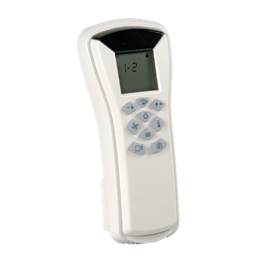

# Distech Remote

# 📡 Cloned IR Remote – Flipper Zero

Here are the infrared commands I cloned using the **Flipper Zero** to control a smart system (ventilation, windows, lighting, temperature, and modes).

## 🧭 Available Functions

### 🔄 Ventilation
- `Vent_menu` – Access the ventilation menu  
- `Vent_up` – Increase ventilation  
- `Vent_down` – Decrease ventilation  

### 🪟 Windows
- `Window_up` – Raise the windows  
- `Window_down` – Lower the windows  

### 💡 Lights
- `Light_up` – Increase light intensity  
- `Light_down` – Decrease light intensity  

### 🌡 Temperature
- `Temp_menu` – Access the temperature menu  
- `Temp_up` – Increase temperature  
- `Temp_down` – Decrease temperature  

### 🛠 Modes
- `Inside_mode` – Activate inside mode  
- `Outside_mode` – Activate outside mode  
